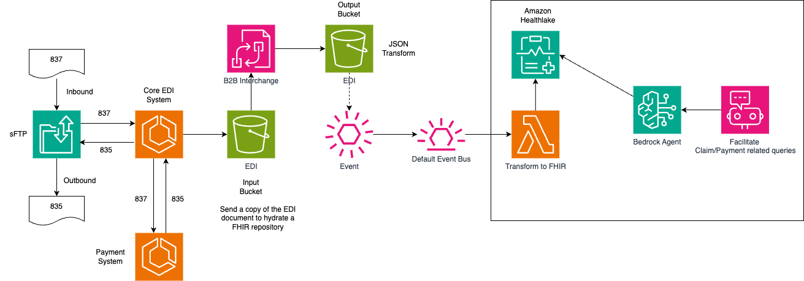

# Claims Bot CDK Project

This project uses the AWS Cloud Development Kit (CDK) to provision cloud infrastructure for a claims processing bot application. The CDK allows you to define your infrastructure as code using familiar programming languages like Python.

## Project Overview

The claims bot application provides a AI enabled chat interface for helping members and providers get clarity on their claim payments. It uses the data stored in a FHIR repository to generate responses for claim payment related queries. It generates the responses in a clear concise manner by decoding the payment lines. The FHIR repository is populated usiing the EDI data that is sent from the EDI gateway to their trading partners. 

## Architecture
The solution comprises of two parts. The EDI part of the solution integrates the core EDI gateway with a FHIR repository. The data flow is triggered as 837(claims) or 835(Remittance) files are transmitted through the EDI channel. A copy of these files is uploaded to a S3 bucket. The upload object event triggers a Lambda function that invokes the AWS B2B Data Interchange service to transform the EDI to JSON. The output JSON is stored in another S3 bucket. The upload event on this bucket triggers another Lambda function that transforms the EDI specific JSON to an open standard FHIR Claim or ExplanationOfBenefits json based on the EDI type(837 or 835). The FHIR json resource is then stored in Amazon Healthlake. Amazon Healthlake is a fully managed FHIR repository.

The second part of the solution is built using Amazon Bedrock which provides access to several foundational models. In our case, we are using the Claude Haiku 3 model but it can be changed based on customer requirements. It also uses the Bedrock Agent feature to provide a chat bot for querying claim payment. The Agent uses a Lambda function as the action group. The Lambda function invokes the FHIR repository in Amazon Healthlake to retrieve ExplanationOfBenefits resource based on the search parameters retrieved from the chat session. The FHIR resource is then sent to the foundational model for generating resonses that are well interpreted and explained in English language. It can also provide responses on follow up questions for responses that can be generated from the FHIR resource.

This CDK project sets up the necessary AWS services and resources to run the Claims Bot application, including:

- AWS Lambda functions for the action groups, triggering B2B data interchange job, transforming EDI json to FHIR and load to Amazon Healthlake
- AWS Identity and Access Management (IAM) roles and policies
- AWS Data Interchange transformer job
- S3 buckets to received EDI files and store outputs

## Prerequisites

Before you can deploy this project, you'll need:

- An AWS account and credentials configured locally
- The AWS CDK toolkit installed (`npm install -g aws-cdk`)
- Python 3.7 or later

## Deployment

1. Clone this repository.
2. Create a Python virtual environment and activate it.
3. Install the project dependencies: `pip install -r requirements.txt`
4. Bootstrap the CDK app: `cdk bootstrap`
5. Deploy the CDK app: `cdk deploy`

## Useful Commands

- `cdk ls` - List all stacks in the app
- `cdk synth` - Synthesize the CloudFormation template for the stacks
- `cdk deploy` - Deploy the stacks to your AWS account
- `cdk diff` - Compare the deployed stack with the current state
- `cdk docs` - Open the CDK documentation

## Contributing

Contributions are welcome! Please open an issue or submit a pull request.

## License

This project is licensed under the [MIT License](LICENSE).
